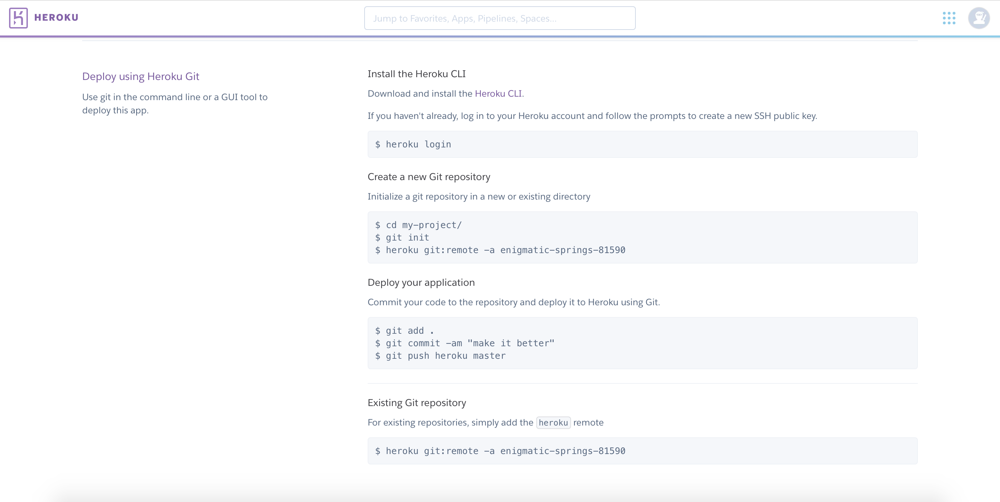
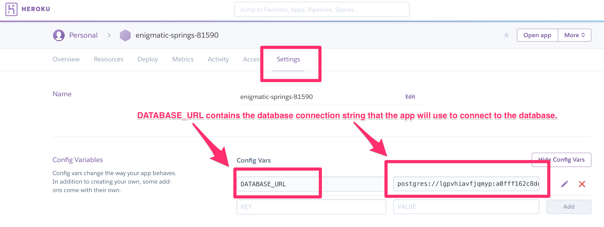

# Flask Data Visualization Template with some special sause for easy Heroku Deployment

A full-stack Flask data visualization template equipped with Pandas, Bootstrap (v4.3.1), D3 (v5), Leaflet (v1.5.1) and SQLAlchemy -- organized using a design pattern optimized for seamless Heroku deployment process in mind. This template contains some sample code for demonstration purposes and uses MySQL for data storage, but is compatible with most other relational databases, e.g, Postgres.

test
test 4
test 1

## Dependencies
- [Git](https://git-scm.com/downloads)
- [Anaconda](https://www.anaconda.com/distribution/) or [Python 3](https://www.python.org/downloads/) + [Virtualenv](https://www.python.org/downloads/) 
- [Heruku cli](https://devcenter.heroku.com/articles/heroku-cli#download-and-install)

## Instructions
#### Part 1: Development Enviroment setup
1. Clone template repository
```sh
git clone https://github.com/Dt1431/flask-heroku-template.git
```
2. Navigate into the new repository's root directory
```sh
cd /path/to/your/repo/flask-heroku-template
```
3. Create virtual enviroment for application
```sh
# For anaconda (note: you can use other versions of python 3)
conda create -n app_env python=3.6
# For regular old python + virtualenv
virtualenv app_env
```
4. Activate your virtual enviroment
```sh
# For anaconda (MAC, PC, Linux)
conda activate app_env
# OR
source activate app_env

# For regular old python + virtualenv
# PC (CMD)
app_env\Scripts\activate
# OR
app_env/Scripts/activate
# MAC, Linux
source app_env/bin/activate
```
5. Install python dependencies
```sh
pip install -r requirements.txt
```
6. Test the app by first initializing the database:

```sh
python initdb.py
```

* Run the app using the following:


```
FLASK_APP=pet_pals/app.py flask run
```

* Now that all of the the project dependencies are installed, we need to generate the `requirements.txt` file. This file is a list of the Python packages required to run the app, we run `pip freeze > requirements.txt`. Heroku will use this file to install all of the app's dependencies.

* The final configuration file that we need is `Procfile`. This file is used by Heroku to run the app.


```
touch Procfile
```

* Open Procfile in vscode and add the following line:


```
web: gunicorn pet_pals.app:app
```

* Explain that `pet_pals` is the name of the folder that contains your app as a python package (i.e. the name of the folder with the `__init__.py` file in it).

#### Part 2: Production Enviroment Setup (Heruku)

* On Heroku, go to the `Deploy` section of your app's homepage, and follow the steps to deploy the app.

  

#### Part 3: Preparing the Database

* After creating a new app on Heroku, navigate to `Resources`:

  

  * Under `Add-ons`, add `Heroku Postgres`. Make sure to use the free version.

* Click on the add on, then navigate to settings and click on `Reveal Config Variables`.

* The connection string to the database should now be available:

  

* Heroku will automatically assign this URI string to the `DATABASE_URL` environment variable that is used within `app.py`. The code that is already in `app.py` will be able to use that environment variable to connect to the Heroku database.

  ```python
  # DATABASE_URL will contain the database connection string:
  app.config['SQLALCHEMY_DATABASE_URI'] = os.environ.get('DATABASE_URL', '')
  # Connects to the database using the app config
  db = SQLAlchemy(app)
  ```

* After adding the database, the final step is to initialize the database. To do this, we use the heroku cli. From the terminal, type the following:


```
heroku run initdb.py
```

* Your database is now initialized, and you can open the application using `heroku open` from the terminal.

## Common Issues

#### Windows (Git Bash) - No command 'conda conda'
This is a known anaconda bug introduced in version 4.6.9, but has been corrected. The easiest way to fix this issue is to upgrade anaconda using the following command.
```
conda update --all
```
#### ERROR: ModuleNotFoundError: No module named 'MySQLdb'
Install a mysql client for python. I'd recommend mysqlclient.
```
pip install mysqlclient
```
If you're having issues there are other options [other options](https://docs.sqlalchemy.org/en/13/dialects/mysql.html). Note: "Clients" are often called databse APIs or DBAPIs, don't be confused by the terminology, you're in the right place.

#### ERROR: Access denied for user 'admin'@'localhost' (using password: YES)")
You've got the wrong username or password! If you can't remember your username and password but have access to the DB via MySQL workbench you can create a new user by running the following SQL statments which create a new user and password admin/P@SSW0RD. 
```
CREATE USER 'admin'@'localhost' IDENTIFIED BY 'P@SSW0RD';
GRANT ALL PRIVILEGES ON * . * TO 'admin'@'localhost';
```
